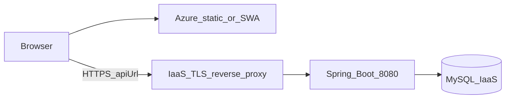

# Azure frontend + IaaS backend/DB (step-by-step)

Assumptions (from your answers): the API is **public HTTPS** from IaaS (e.g. `https://api.example.com`). The browser loads the SPA from Azure and calls that API origin directly (cross-origin, CORS + JWT as you already use).

---

## Phase 1 — IaaS: database (MySQL)

1. **Install and harden MySQL** on a dedicated VM (or existing DB tier): version compatible with your driver (see Hibernate warnings in logs; prefer **MySQL 8.x**).
2. **Create database and user** (least privilege): database `jobmatch_db` (or match `DB_URL`), user with permissions only on that schema.
3. **Networking**
   - Bind MySQL to **private** interface only (e.g. `127.0.0.1` or internal VLAN IP), **not** the public internet.
   - Allow **only** the Spring Boot host(s) to connect (host firewall + DB `bind-address` / security groups).
4. **TLS to DB (recommended for prod)**  
   - Use a JDBC URL with TLS as in comments in [application-prod.properties](PI-Backend-main/PI-Backend-main/src/main/resources/application-prod.properties) (e.g. `useSSL=true`, `requireSSL=true` once certs are in place).  
   - Set `DB_URL`, `DB_USERNAME`, `DB_PASSWORD` via secrets (not files in git).
5. **Backups and maintenance**  
   - Automated backups, restore test, and patch window for MySQL OS + engine.

---

## Phase 2 — IaaS: Spring Boot application

1. **Build the artifact** (on CI or build VM): `mvnw -B -DskipTests package` in [PI-Backend-main/PI-Backend-main](PI-Backend-main/PI-Backend-main); output JAR under `target/`.
2. **Container (recommended)**  
   - Build image from [Dockerfile](PI-Backend-main/PI-Backend-main/Dockerfile) and push to **your** registry (or load image on host).  
   - Run with `SPRING_PROFILES_ACTIVE=prod` and all env vars (below).
3. **Required environment variables / secrets** (minimum for a working secure deploy)
   - `SPRING_PROFILES_ACTIVE=prod`
   - `JWT_SECRET` — strong random secret (required in prod profile per [application-prod.properties](PI-Backend-main/PI-Backend-main/src/main/resources/application-prod.properties))
   - `DB_URL`, `DB_USERNAME`, `DB_PASSWORD`
   - **`APP_CORS_ALLOWED_ORIGINS`** — comma-separated **exact** origins of your Azure frontend, e.g. `https://your-app.azurestaticapps.net` or `https://www.yourdomain.com` (no trailing slash). Wired in [SecurityConfig.java](PI-Backend-main/PI-Backend-main/src/main/java/t/esprit/arctic/jobmatch/config/SecurityConfig.java) from [application.properties](PI-Backend-main/PI-Backend-main/src/main/resources/application.properties).
   - Optional but common: `MAIL_*`, Pusher/Twilio if you use them, `ML_INTERNAL_API_KEY` if Python ML services enforce it.
4. **Outbound URLs to ML services** (if ML stays on IaaS)  
   - Set `AI_GENERATOR_BASE_URL`, `ML_SERVICE_URL`, `FLASK_ML_URL`, `FLASK_RECOMMENDATION_URL` to **internal** or **public** service URLs as you design (not `localhost`).  
   - **Important code gap:** [DocumentController.java](PI-Backend-main/PI-Backend-main/src/main/java/t/esprit/arctic/jobmatch/controller/DocumentController.java), [JobMatchingController.java](PI-Backend-main/PI-Backend-main/src/main/java/t/esprit/arctic/jobmatch/controller/JobMatchingController.java), and [CvAnalyseController.java](PI-Backend-main/PI-Backend-main/src/main/java/t/esprit/arctic/jobmatch/controller/CvAnalyseController.java) still hardcode `http://localhost:8000`. Before production, refactor these to `@Value("${...}")` properties (same pattern as [MLOptimizationService.java](PI-Backend-main/PI-Backend-main/src/main/java/t/esprit/arctic/jobmatch/service/MLOptimizationService.java) / `application.properties`) so Azure/IaaS never depends on localhost.
5. **TLS termination in front of Spring**  
   - Put **nginx**, **HAProxy**, or a cloud LB in front of the container/host on **443** with a real certificate (Let’s Encrypt or corporate PKI).  
   - Proxy `/` to Spring on `8080` (or internal port). No Spring `context-path` is configured today; controllers live under `/api/...`.
6. **Health checks**  
   - Use `/actuator/health/readiness` and `/actuator/health/liveness` for LB/orchestrator probes (already referenced in [backend-deployment.yaml](PI-Backend-main/PI-Backend-main/deploy/k8s/backend-deployment.yaml) pattern).
7. **Firewall**  
   - Open **443** (and **80** only if you redirect to HTTPS) to the internet; keep **3306** closed from the internet.

---

## Phase 3 — Azure: static frontend

Because the SPA is on a **different origin** than the API, [environment.prod.ts](PI-Frontend-main/PI-Frontend-main/src/environments/environment.prod.ts) cannot stay as `apiUrl: '/api'` and `mlUrl: '/ml'` for production unless Azure also reverse-proxies those paths to IaaS (possible with **Azure Front Door** or **Static Web Apps** `routes` / `staticwebapp.json`, but that is an extra design). The straightforward approach:

1. **Choose Azure hosting**
   - **Azure Static Web Apps (SWA)** — simple CI/CD from GitHub, free tier options, custom domain + TLS.  
   - **Storage static website + Azure CDN** — cheap static hosting; configure CDN custom domain + HTTPS.  
   - **App Service (Linux) + nginx container** — use your [Dockerfile](PI-Frontend-main/PI-Frontend-main/Dockerfile) if you prefer container parity with local nginx.
2. **Production Angular env (critical)**  
   - Set **`apiUrl`** to your public API base for REST, e.g. `https://api.example.com` if your Angular code already prefixes `/api` on calls, or `https://api.example.com/api` if services expect the full base including `/api` (audit [api.service.ts](PI-Frontend-main/PI-Frontend-main/src/app/api.service.ts) and other services: today dev uses `environment.apiUrl` as `/api`).  
   - Set **`mlUrl`** to wherever ML is reachable from the browser **or** from the backend only. If only the backend calls ML, the SPA might still need `mlUrl` for direct browser calls (grep `environment.mlUrl`); align with your reverse proxy or a second public hostname.
   - Easiest maintainable approach: **CI injects** `environment.prod.ts` (or `fileReplacements` to a generated file) with real HTTPS URLs at build time so secrets never live in git.
3. **Build command** (matches CI in [.github/workflows/ci.yml](.github/workflows/ci.yml))  
   - In `PI-Frontend-main/PI-Frontend-main`: `npm ci` then `npm run build -- --configuration=production`.  
   - Deploy the contents of `dist/jove/` (see Dockerfile `COPY --from=build`) to SWA or Storage.
4. **Custom domain on Azure**  
   - Add DNS CNAME to Azure; enable managed certificate in SWA/CDN/App Service.
5. **CORS final check**  
   - After you know the final SPA URL, set `APP_CORS_ALLOWED_ORIGINS` on the backend to that exact origin (scheme + host + port if non-default). Include both `www` and apex if you use both.

---

## Phase 4 — End-to-end verification

1. Open SPA URL over HTTPS; log in / hit a public endpoint.
2. In browser DevTools **Network**: confirm API calls go to `https://api...` and return **200** (not blocked by CORS).
3. Call `GET https://api.../actuator/health` (from curl or LB) — expect **UP** with your prod health config ([application.properties](PI-Backend-main/PI-Backend-main/src/main/resources/application.properties) mail indicator disabled if unused).
4. Load test critical flows (auth, file upload, ML if used).

---

## Phase 5 — Operational extras (recommended)

1. **Secrets**: store DB password and `JWT_SECRET` in a vault (Azure Key Vault for Azure-side; on IaaS use your org standard) and inject at runtime.
2. **Logging / monitoring**: JSON logs (if enabled), central log aggregation, alerts on 5xx and DB connectivity.
3. **Rate limiting / WAF**: at reverse proxy or edge (optional but good for public API).
4. **Cloudinary** (in [environment.prod.ts](PI-Frontend-main/PI-Frontend-main/src/environments/environment.prod.ts)): use a **production** preset and restrict upload types/size in Cloudinary dashboard.

---

## Summary checklist

| Area | Action |
|------|--------|
| MySQL | Private network, backups, TLS JDBC URL, strong `DB_PASSWORD` |
| API | HTTPS reverse proxy, `prod` profile, `JWT_SECRET`, `APP_CORS_ALLOWED_ORIGINS` = Azure SPA origin |
| Code | Replace hardcoded `localhost:8000` in the three controllers with configurable properties |
| Angular prod | Absolute `apiUrl` / `mlUrl` (or Azure path proxy) — build-time injection |
| Azure | Host `dist/jove`, custom domain + HTTPS |
| Verify | Browser CORS, auth, health, main user journeys |

No Azure Bicep/Terraform is in this repo; you will create the Azure resources (SWA/Storage/CDN/App Service) in the portal or IaC separately.
